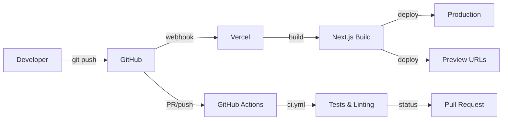

# Deployment Guide

## Overview

This project uses **Vercel** for hosting and deployment with automatic CI/CD via GitHub integration.

## Deployment Architecture



## Automatic Deployments

### Production Deployment

- **Trigger**: Push to `main` branch
- **URL**: https://lawlzer-website.vercel.app
- **Environment**: Production environment variables

### Staging Deployment

- **Trigger**: Push to `staging` branch
- **URL**: Auto-generated preview URL
- **Environment**: Staging environment variables

### Preview Deployments

- **Trigger**: Any pull request
- **URL**: Unique preview URL per PR
- **Environment**: Preview environment variables

## Manual Deployment

If needed, you can deploy manually using Vercel CLI:

```bash
# Install Vercel CLI
npm i -g vercel

# Deploy to preview
vercel

# Deploy to production
vercel --prod
```

## Environment Variables

Manage environment variables in the [Vercel Dashboard](https://vercel.com/dashboard/project/lawlzer-website/settings/environment-variables).

### Required Variables

```env
# Database
DATABASE_URL=<mongodb-connection-string>

# OAuth Providers
AUTH_GOOGLE_SECRET=<google-oauth-secret>
AUTH_DISCORD_SECRET=<discord-oauth-secret>
AUTH_GITHUB_SECRET=<github-oauth-secret>

# Public OAuth IDs
NEXT_PUBLIC_AUTH_GOOGLE_ID=<google-oauth-id>
NEXT_PUBLIC_AUTH_DISCORD_ID=<discord-oauth-id>
NEXT_PUBLIC_AUTH_GITHUB_ID=<github-oauth-id>

# Domain Configuration
NEXT_PUBLIC_SCHEME=https
NEXT_PUBLIC_SECOND_LEVEL_DOMAIN=<your-domain>
NEXT_PUBLIC_TOP_LEVEL_DOMAIN=<com|org|etc>
NEXT_PUBLIC_FRONTEND_PORT=443
```

### Environment Scopes

Vercel supports different variables for different environments:

- **Production**: Applied to production deployments
- **Preview**: Applied to all preview deployments
- **Development**: Used with `vercel dev`

## Build Configuration

The build process is configured in `vercel.json`:

- **Framework**: Next.js (auto-detected)
- **Build Command**: `npm run build`
- **Output Directory**: `.next`
- **Node Version**: 20.x (auto-detected from `.nvmrc` or `package.json`)

## Performance Optimizations

### Caching

- Static assets cached for 1 year with immutable headers
- Build cache preserved between deployments
- ISR (Incremental Static Regeneration) supported

### Security Headers

- X-Frame-Options: DENY
- X-Content-Type-Options: nosniff
- X-XSS-Protection: 1; mode=block

### Function Limits

- API routes limited to 10 seconds execution time
- Adjust in `vercel.json` if needed

## Monitoring & Logs

### Deployment Status

- GitHub deployment status visible on PR/commit
- Vercel dashboard shows detailed build logs
- Function logs available in Vercel dashboard

### Analytics

- Web Analytics available in Vercel dashboard
- Real User Monitoring (RUM) for performance metrics

## Rollback & Recovery

### Instant Rollback

1. Go to Vercel dashboard
2. Navigate to Deployments tab
3. Find previous successful deployment
4. Click "..." menu → "Promote to Production"

### Git Revert

```bash
# Revert the last commit
git revert HEAD
git push origin main

# Or reset to specific commit
git reset --hard <commit-hash>
git push --force origin main
```

## Custom Domain Setup

1. Add domain in Vercel dashboard
2. Update DNS records:
   - **A Record**: Point to Vercel's IP
   - **CNAME**: Point to `cname.vercel-dns.com`
3. SSL certificate auto-provisioned

## Troubleshooting

### Build Failures

1. Check build logs in Vercel dashboard
2. Ensure all environment variables are set
3. Verify `npm run build` works locally

### Environment Variable Issues

- Redeploy after adding/changing variables
- Use Vercel CLI to verify: `vercel env pull`

### Performance Issues

- Check Function logs for timeouts
- Review bundle size with `@next/bundle-analyzer`
- Enable caching headers for static assets

## CI/CD Pipeline

GitHub Actions runs these checks before deployment:

1. **Linting**: ESLint + Prettier
2. **Type Checking**: TypeScript compiler
3. **Unit Tests**: Vitest
4. **E2E Tests**: Playwright
5. **Build Verification**: Next.js build

Configure branch protection rules to require these checks before merging.
