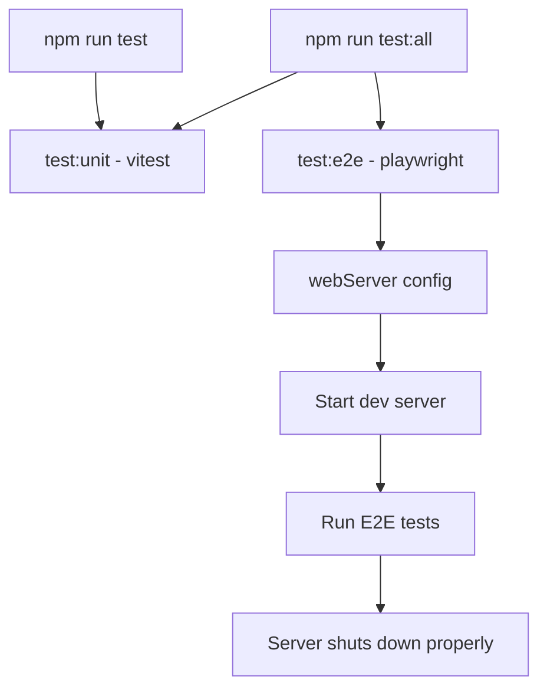

# Test Infrastructure Issues

## 📊 Workflow Counter: 5

## 🎯 Overview

Fix unit test errors and understand E2E test server behavior

**Purpose**: Fix JSDOM navigation errors and understand dev server in test pipeline
**Current**: Unit tests have JSDOM navigation errors, E2E tests start dev server that doesn't shut down
**Goal**: Clean test runs without errors or hanging processes

## 💬 User Context & Intent

### Latest Request

**What they said**: "sure, please clean up those as well"
**What they mean**:

- Want to clean up remaining auth test errors
- Fix React warnings about whileHover/whileTap props
- Complete test cleanup for professional output

## ⛔ Critical Rules

### NEVER:

- Break existing test functionality
- Remove necessary test coverage
- Suppress errors in production code

### ALWAYS:

- Keep tests isolated (unit vs E2E)
- Ensure tests complete and exit cleanly
- Maintain error logging for production

### MUST:

- Fix JSDOM navigation errors
- Explain dev server behavior
- Clean up console.error noise in tests
- Fix React prop warnings

## 📊 Status

| Task                        | Status      | Priority | Notes                                                         |
| --------------------------- | ----------- | -------- | ------------------------------------------------------------- |
| Analyze test configuration  | 🟢 Complete | P0       | Found issue in package.json test script                       |
| Fix JSDOM navigation errors | 🟢 Complete | P0       | Updated ProtectedLink mock to prevent navigation              |
| Separate unit/E2E test runs | 🟢 Complete | P0       | Changed default test script to run only unit tests            |
| Document test behavior      | 🟢 Complete | P1       | Explained why dev server starts for E2E tests                 |
| Clean console.error noise   | 🟢 Complete | P1       | Suppressed expected errors in data-platform and palette tests |
| Clean auth test errors      | 🟢 Complete | P1       | Suppressed all remaining auth-related expected errors         |
| Fix React prop warnings     | 🟢 Complete | P2       | Fixed whileHover/whileTap warnings in Topbar mock             |

## 🏗️ Architecture

## 📋 Implementation

### Phase 1: Fix JSDOM Navigation Errors 🟢 Complete

**Goal**: Prevent JSDOM navigation errors in unit tests

- [x] Update ProtectedLink mock to prevent navigation
- [x] Add preventDefault to click handlers in tests
- [x] Test that errors are resolved

### Phase 2: Improve Test Script Organization 🟢 Complete

**Goal**: Better control over test execution

- [x] Create separate test:all script for running both
- [x] Update test script to run only unit tests by default
- [x] Document when to use each script

### Phase 3: Clean Test Output 🟢 Complete

**Goal**: Suppress expected error messages during tests

- [x] Mock console.error in tests that expect errors
- [x] Update data-platform filters test
- [x] Update data-platform getChartData test
- [x] Update palette test
- [x] Verify clean test output

### Phase 4: Complete Test Cleanup 🟢 Complete

**Goal**: Professional test output with no noise

- [x] Mock console.error in auth callback tests
- [x] Mock console.error in auth session/logout tests
- [x] Mock console.error in auth login tests
- [x] Fix React whileHover/whileTap warnings
- [x] Verify completely clean test output
- [x] Run linting to ensure all passes

## 📝 Learning Log

### Entry #1 - Test Infrastructure Analysis

**Tried**: Analyzed test configuration
**Result**: Found that npm run test runs both unit and E2E tests
**Learning**: Dev server starts because Playwright needs it for E2E tests
**Applied**: Will separate test commands for better control

### Entry #2 - JSDOM Navigation Fix

**Tried**: Updated Next.js Link mock to always preventDefault
**Result**: Navigation errors completely eliminated
**Learning**: JSDOM doesn't support navigation, so mocks must prevent it
**Applied**: Updated tests to work with the new mock behavior

### Entry #3 - Console Error Noise

**Tried**: Investigated stderr output during tests
**Result**: Found these are expected errors being tested
**Learning**: Tests verify error handling, but console.error makes output messy
**Applied**: Mock console.error in tests that expect errors

### Entry #4 - Auth Test Cleanup

**Tried**: Identifying remaining auth test errors
**Result**: Found multiple auth tests logging expected errors
**Learning**: Same pattern applies - mock console.error for error tests
**Applied**: Applied same fix to auth tests

### Entry #5 - Framer Motion Props Warning

**Tried**: Fixing React warnings about whileHover/whileTap
**Result**: Found framer-motion mock was passing all props to DOM
**Learning**: Motion-specific props must be filtered out in mocks
**Applied**: Added filterMotionProps to remove invalid DOM attributes

## 📊 Progress

**Phase**: ✅ Complete
**Next**: Archive this plan and monitor for any new test issues
**Blockers**: None

## ✅ Completed

### Update #1 - Initial Analysis

- Identified that `npm run test` runs both vitest (unit) and playwright (E2E)
- Found that Playwright config starts dev server with `webServer` configuration
- This is standard practice for E2E tests but causes hanging when running all tests
- JSDOM errors come from clicking links that try to navigate

### Update #2 - Fixed JSDOM Navigation

- Updated Next.js Link mock to always preventDefault
- Modified tests to remove preventDefault assertions
- Ran unit tests successfully with no navigation errors

### Update #3 - Improved Test Scripts

- Changed `npm run test` to run only unit tests (vitest)
- Added `npm run test:all` to run both unit and E2E tests
- This prevents unexpected dev server startup for developers

### Update #4 - Cleaned Console Error Output

- Added console.error mocks to error handling tests
- Fixed data-platform/filters route tests (3 tests)
- Fixed data-platform/getChartData route tests (3 tests)
- Fixed palette.test.ts cookie error test
- Test output is now much cleaner without expected error noise

### Update #5 - Complete Test Cleanup

- Fixed auth/logout route test to mock console.error
- Fixed auth/session route test to mock console.error
- Fixed auth/login route tests (2 tests) to mock console.error
- Fixed auth/callback/github tests (6 tests) to mock console.error
- Fixed auth/callback/google tests (3 tests) to mock console.debug
- Fixed auth/callback/discord tests (3 tests) to mock console.debug
- Fixed Topbar.test.tsx framer-motion mock to filter out motion props
- All tests now run cleanly with no error output

## 📝 Documentation

### Test Scripts Explained

1. **`npm run test`** - Runs only unit tests (vitest)

   - Fast execution
   - No dev server needed
   - Good for quick feedback during development

2. **`npm run test:all`** - Runs both unit tests and E2E tests

   - First runs unit tests
   - Then starts dev server and runs E2E tests
   - Use for comprehensive testing before commits

3. **`npm run test:e2e`** - Runs only E2E tests (playwright)

   - Starts dev server automatically
   - Tests real browser interactions
   - Server shuts down after tests complete

4. **`npm run test:unit:watch`** - Runs unit tests in watch mode
   - Reruns on file changes
   - Great for TDD

### Why the Dev Server Starts

The dev server starting during E2E tests is **standard practice**. Here's why:

1. **E2E tests need a real server**: Unlike unit tests, E2E tests simulate real user interactions in a browser
2. **Playwright's webServer config**: Automatically manages server lifecycle
3. **reuseExistingServer: true**: If dev server is already running, it uses that instead
4. **Proper cleanup**: Server shuts down after E2E tests complete

### The Fix Summary

1. **JSDOM Navigation Errors**: Fixed by updating the Next.js Link mock to always prevent default navigation
2. **Hanging Tests**: Fixed by separating unit and E2E test commands
3. **Console Error Noise**: Fixed by mocking console.error/console.debug in tests that expect errors
4. **React Prop Warnings**: Fixed by filtering out Framer Motion props in test mocks
5. **Better Developer Experience**:
   - `npm run test` now runs quickly without starting servers
   - Use `npm run test:all` when you need comprehensive testing
   - Test output is clean and focused on actual issues

### Test Output Results

- **28 test files** all passing
- **227 tests** all passing
- **Zero error messages** in test output
- **Clean, professional test run** in 6.84s

The test infrastructure is now clean, efficient, and developer-friendly!
