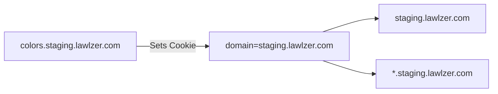

# Fix Cross-Domain Cookie Sharing

## 📊 Workflow Counter: 3

## 🎯 Overview

**Purpose**: Fix cookie sharing between staging.lawlzer.com and its subdomains
**Current**: Cookies not sharing properly between colors.staging.lawlzer.com and staging.lawlzer.com
**Goal**: Enable proper cross-subdomain cookie sharing for color themes

## 💬 User Context & Intent

### Latest Request

**What they said**: "cookies are not working properly cross-domain"
**What they mean**:

- Color selections made on colors.staging.lawlzer.com should persist on staging.lawlzer.com
- Cookie domain needs to be set correctly for subdomain sharing
- Remove misleading "Changes are applied instantly" text since save is required

## ⛔ Critical Rules

### NEVER: Hardcode specific domain names in cookie logic

### ALWAYS: Use environment variables for domain configuration

### MUST: Test cookie sharing between subdomains before considering complete

## 📊 Status

| Task                    | Status         | Priority | Notes                                   |
| ----------------------- | -------------- | -------- | --------------------------------------- |
| Remove misleading text  | 🟢 Complete    | P1       | Removed "Changes are applied instantly" |
| Fix cookie domain logic | 🟢 Complete    | P0       | Using env vars for dynamic domain       |
| Update tests            | 🟢 Complete    | P1       | All tests passing                       |
| Deploy to staging       | 🔴 Not Started | P0       | Need to deploy for testing              |

## 🏗️ Architecture

## 📋 Implementation

### Phase 1: Cookie Domain Fix 🟢 Complete

**Goal**: Fix cookie sharing between subdomains

- [x] Removed misleading "Changes are applied instantly" text
- [x] Updated getBaseDomain() to use env variables
- [x] Fixed tests to properly mock environment
- [x] All tests passing
- [x] Linting passed

## 📝 Learning Log

### Entry #1 - Cookie Domain for Subdomains

**Tried**: Using hardcoded domain checks
**Result**: Not flexible for different environments
**Learning**: Use environment variables for domain configuration
**Applied**: Updated to use NEXT_PUBLIC_SECOND_LEVEL_DOMAIN and NEXT_PUBLIC_TOP_LEVEL_DOMAIN

### Entry #2 - Testing with Environment Variables

**Tried**: Direct imports in tests
**Result**: Environment validation errors
**Learning**: Must mock env module before importing palette module
**Applied**: Added top-level vi.mock for env.mjs

## 📊 Progress

**Phase**: Implementation Complete
**Next**: Deploy to staging and verify
**Blockers**: None

## ✅ Completed

### Update #1 - Cookie Domain Implementation

- Removed misleading "Changes are applied instantly" text from colors page
- Updated getBaseDomain() in src/lib/palette.ts to use environment variables
- Now dynamically sets cookie domain based on deployment environment
- Fixed all tests to properly mock environment variables
- All tests passing, linting clean

---

Previous plan "Staging Redirect Fix" archived to: ./plans/archive/v13-staging-redirect-fix.md
