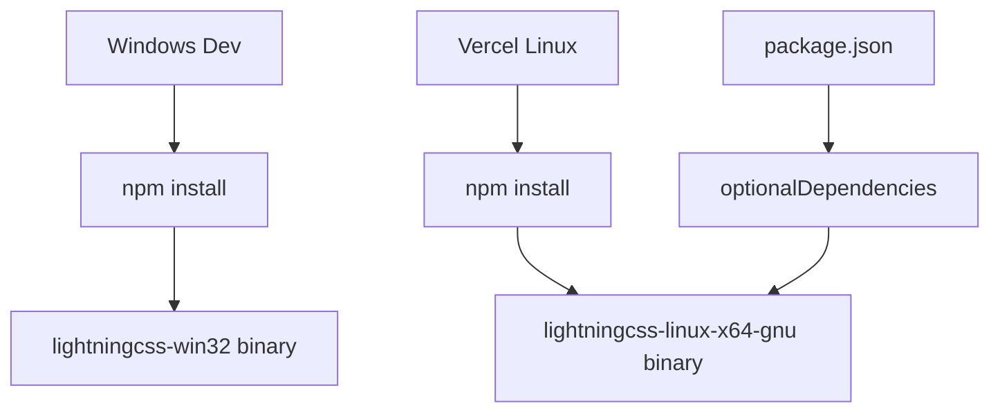

# Vercel Deployment Fix

## 📊 Workflow Counter: 2

## 🎯 Overview

**Purpose**: Fix Vercel deployment issues with lightningcss
**Current**: Fixed lightningcss Linux binary missing error
**Goal**: Ensure stable deployments to Vercel

## 💬 User Context & Intent

### Latest Request

**What they said**: "Please run 'vercel', and fix any issues you see"
**What they mean**:

- Need to fix the build failure on Vercel
- Ensure deployment works consistently
- The issue was related to missing Linux binaries

## ⛔ Critical Rules

### NEVER: Create documentation files unless explicitly requested

### ALWAYS: Use --no-pager flags to avoid interactive prompts

### MUST: Ensure deployments work on both Windows (dev) and Linux (Vercel)

## 📊 Status

| Task                   | Status         | Priority | Notes                                     |
| ---------------------- | -------------- | -------- | ----------------------------------------- |
| Fix lightningcss error | 🟢 Complete    | P0       | Added Linux binary as optional dependency |
| Test deployment        | 🟢 Complete    | P0       | Preview deployment successful             |
| Deploy to production   | 🔴 Not Started | P1       | Ready when user confirms                  |

## 🏗️ Architecture

## 📋 Implementation

### Phase 1: Fix Deployment Error 🟢 Complete

**Goal**: Resolve lightningcss Linux binary missing error

- [x] Identified the error: Cannot find module '../lightningcss.linux-x64-gnu.node'
- [x] Added lightningcss-linux-x64-gnu as optional dependency in package.json
- [x] Installed dependencies with --legacy-peer-deps
- [x] Committed changes
- [x] Successfully deployed to Vercel preview

## 📝 Learning Log

### Entry #1 - Tailwind CSS v4 uses Lightning CSS

**Tried**: Direct deployment without Linux binary
**Result**: Build failed with missing lightningcss.linux-x64-gnu.node
**Learning**: Tailwind CSS v4 uses Lightning CSS internally which requires platform-specific binaries
**Applied**: Added Linux binary as optional dependency

### Entry #2 - Optional Dependencies for Cross-Platform

**Tried**: Install lightningcss in postinstall script
**Result**: More complex than needed
**Learning**: Using optionalDependencies in package.json is cleaner for platform-specific binaries
**Applied**: Added "lightningcss-linux-x64-gnu": "1.30.1" to optionalDependencies

## 📊 Progress

**Phase**: Deployment fix complete
**Next**: Deploy to production when ready
**Blockers**: None

## ✅ Completed

### Update #1 - Fixed Vercel Deployment

- Identified lightningcss Linux binary issue
- Added lightningcss-linux-x64-gnu@1.30.1 as optional dependency
- Successfully deployed to preview: https://lawlzer-website-fzo8m1218-kevin-porters-projects.vercel.app
- Build now works on both Windows (development) and Linux (Vercel)

---

Ready for production deployment with `vercel --prod` when needed!
