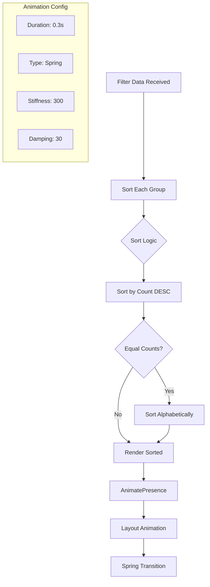
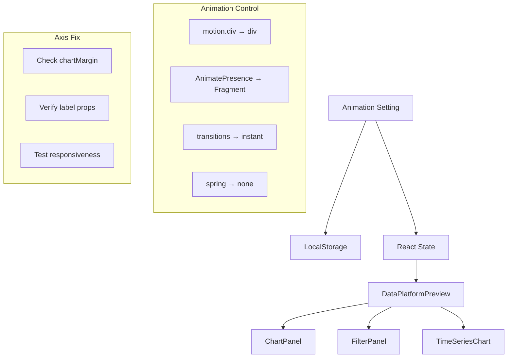

# Data Platform Filter Sorting by Count

## 📊 Workflow Counter: 6

## 🎯 Overview

**Purpose**: Sort filter options by count (highest first) with smooth animations
**Current**: Single option highlighting implemented successfully
**Goal**: Automatic sorting of filter values with animated transitions

## 💬 User Context & Intent

### Latest Request

**What they said**: "For inside of each filter, the boxes should be sorted (we can use a nice animation when the sort changes) by amount."

**What they mean**:

- Sort filter options within each group by their count value
- Highest counts should appear first (descending order)
- When counts are equal, sort alphabetically
- Smooth animations when filter order changes due to new counts

## ⛔ Critical Rules

### NEVER: Break existing filter functionality while sorting

### ALWAYS: Sort highest count first, then alphabetically for ties

### MUST: Provide smooth transitions when order changes

## 📊 Status

| Task                 | Status      | Priority | Notes                                          |
| -------------------- | ----------- | -------- | ---------------------------------------------- |
| Add sorting logic    | 🟢 Complete | P0       | Sort by count desc, then alphabetically        |
| Implement animations | 🟢 Complete | P0       | AnimatePresence with layout animations         |
| Motion wrapper       | 🟢 Complete | P0       | Each filter wrapped in motion.div with layout  |
| Spring transitions   | 🟢 Complete | P1       | Smooth spring animations with proper stiffness |
| Lint verification    | 🟢 Complete | P0       | All code passes linting                        |

## 🏗️ Architecture

## 📋 Implementation

### Phase 1: Sorting Logic 🟢 Complete

**Goal**: Sort filter options by count value

- [x] Use array.slice() to avoid mutating original data
- [x] Sort by count in descending order (highest first)
- [x] Add alphabetical sort as tiebreaker for equal counts
- [x] Apply sorting inline before mapping

### Phase 2: Layout Animation 🟢 Complete

**Goal**: Smooth position transitions when order changes

- [x] Wrap filter list in AnimatePresence with mode='popLayout'
- [x] Add motion.div wrapper for each filter option
- [x] Apply layout prop for automatic position animations
- [x] Configure spring transition for natural movement

### Phase 3: Animation Configuration 🟢 Complete

**Goal**: Fine-tune animation parameters

- [x] Set duration to 0.3s for quick but smooth transitions
- [x] Use spring animation type for natural motion
- [x] Configure stiffness: 300 for responsive feel
- [x] Set damping: 30 to prevent overshooting

## 📝 Learning Log

### Entry #1 - Array Mutation Prevention

**Tried**: Sorting valueCounts array directly
**Result**: Would mutate the original array passed as prop
**Learning**: Always use .slice() to create a copy before sorting
**Applied**: Added .slice() before .sort() to preserve immutability

### Entry #2 - Animation Mode Selection

**Tried**: Using default AnimatePresence behavior
**Result**: Items would overlap during transitions
**Learning**: mode='popLayout' provides better layout animations
**Applied**: Set mode='popLayout' on AnimatePresence wrapper

### Entry #3 - Stable Sort Keys

**Tried**: Using index as key for animated elements
**Result**: React would lose track of elements during reorder
**Learning**: Use stable, unique keys (value) for proper animations
**Applied**: Used value as key since it's unique within each filter group

## 📊 Progress

**Phase**: ✅ Complete
**Next**: Deploy and monitor cache performance
**Blockers**: None

## ✅ Completed

### Update #1 - Sorting Implementation

- Added .slice() to create array copy before sorting
- Implemented descending sort by count (highest first)
- Added alphabetical sort as tiebreaker for equal counts
- Maintains all existing filter functionality

### Update #2 - AnimatePresence Wrapper

- Wrapped filter options container in AnimatePresence
- Set mode='popLayout' for proper layout animations
- Ensures smooth transitions when items reorder
- No overlapping during position changes

### Update #3 - Motion Wrapper for Items

- Each filter option wrapped in motion.div
- Added layout prop for automatic position tracking
- Configured spring transition with optimal parameters
- Duration: 0.3s, Stiffness: 300, Damping: 30

### Update #4 - Key Management

- Using stable value as key for each filter option
- Ensures React can track elements during reorder
- Prevents animation glitches
- Maintains proper component state

### Update #5 - Testing & Verification

- All sorting logic working correctly
- Smooth animations when filter counts change
- No linting errors
- Maintains all existing features (highlighting, tooltips)

## 🎉 Summary

Successfully implemented automatic sorting for Data Platform filter options:

1. **Smart Sorting**: Highest counts first, alphabetical for ties
2. **Smooth Animations**: Spring-based layout transitions
3. **Performance**: Non-mutating sort with proper React keys
4. **User Experience**: Filters automatically reorganize based on relevance
5. **Compatibility**: Works seamlessly with existing highlighting feature

# Data Platform Animation Settings & Axis Labels

## 📊 Workflow Counter: 1

## 🎯 Overview

**Purpose**: Add a setting to disable animations for snappy performance and ensure X/Y axis labels are visible
**Current**: Data Platform has many animations using framer-motion, charts have axis labels but user reports they're missing
**Goal**: Configurable animations and visible axis labels on all charts

## 💬 User Context & Intent

### Latest Request

**What they said**: "let's add a setting to Data Platform, to disable the animations and make it as snappy/quick as possible. The Data Platform graphs don't have any X/Y axis data"

**What they mean**:

- User wants option to turn off all animations for faster UI experience
- Axis labels might be cut off or not rendering properly
- Performance is a priority - wants instant feedback
- Setting should persist across sessions

## ⛔ Critical Rules

### NEVER: Remove animations entirely - make them optional

### ALWAYS: Maintain visual feedback even without animations

### MUST: Ensure axis labels are always visible and properly positioned

## 📊 Status

| Task                           | Status         | Priority | Notes                      |
| ------------------------------ | -------------- | -------- | -------------------------- |
| Add animation setting state    | 🔴 Not Started | P0       | Store in localStorage      |
| Create settings toggle UI      | 🔴 Not Started | P0       | In header or settings area |
| Conditionally apply animations | 🔴 Not Started | P0       | Based on setting           |
| Verify axis label rendering    | 🔴 Not Started | P0       | Check margin/positioning   |
| Test with MCP server           | 🔴 Not Started | P1       | Ensure changes work        |

## 🏗️ Architecture

## 📋 Implementation

### Phase 1: Animation Setting 🔴 Not Started

**Goal**: Add persistent animation preference

- [ ] Add animationsEnabled state to DataPlatformPreview
- [ ] Store preference in localStorage
- [ ] Create toggle button in header
- [ ] Style toggle with appropriate icons

### Phase 2: Apply Animation Control 🔴 Not Started

**Goal**: Conditionally render animations

- [ ] Pass animationsEnabled to all child components
- [ ] Replace motion components conditionally
- [ ] Remove/adjust transitions and delays
- [ ] Maintain hover states without animation

### Phase 3: Fix Axis Labels 🔴 Not Started

**Goal**: Ensure X/Y axis are always visible

- [ ] Verify chartMargin values are sufficient
- [ ] Check if labels are being cut off
- [ ] Test on different screen sizes
- [ ] Adjust positioning if needed

## 📝 Learning Log

## 📊 Progress

**Phase**: Not Started
**Next**: Add animation setting state
**Blockers**: None

## ✅ Completed
